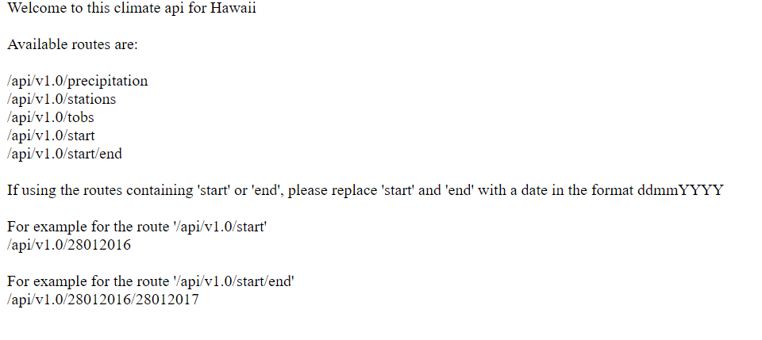

# Using SQLAlchemy and Flask

 ### **Overview**
Using SQL Alchemy explore and analyse climate data from the climate database and Flask to build an app based off the queries.

### **Aspects Covered**
- Using SQLAlchemy to connect to the SQLite database
- Linking python to the database by creating a SQLAlchemy session
- Querying the database to answer specific questions.
- Charting with matplotlib
- Developing a Flask API with different routes based off the earlier queries

### **Visualisations**

### **Folder structure**
The folder *SurfsUp contains:
- *Climate_analysis.ipynb* - analysis undertaken on the climate data
- *app.py* - code for the climate app

The folder *Resources* contains the data files used for this project.

 

---

### **Contact**
Email: kymcoleman@gmail.com

---
